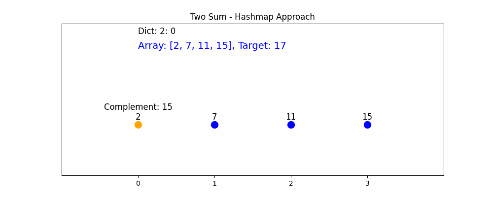

# animation_2sum
Visualize the Two Sum problem using a hashmap approach with an animated GIF. The animation highlights the current element, its complement, and updates the dictionary state. The GIF is saved in the assets directory.


# Two Sum Animation

This repository visualizes the Two Sum problem using a hashmap approach with an animated GIF. The animation highlights the current element, its complement, and updates the dictionary state. The GIF is saved in the assets directory.

## Description

The Two Sum problem is a classic algorithmic problem where the goal is to find two numbers in an array that add up to a specific target value. This project provides a visual representation of the hashmap approach to solving the Two Sum problem.

## Features

- Visualizes the Two Sum problem using a hashmap approach.
- Displays array elements, target value, and complement values during the animation.
- Highlights the current element and its complement if found.
- Saves the animation as a GIF in the assets directory.

## Usage

1. Clone the repository:
    ```sh
    git clone https://github.com/yourusername/animation_2sum.git
    cd animation_2sum
    ```

2. Install the required dependencies:
    ```sh
    pip install matplotlib pillow
    ```

3. Run the script to generate the animation:
    ```sh
    python main.py
    ```

4. The GIF will be saved in the `assets` directory.

## Example


